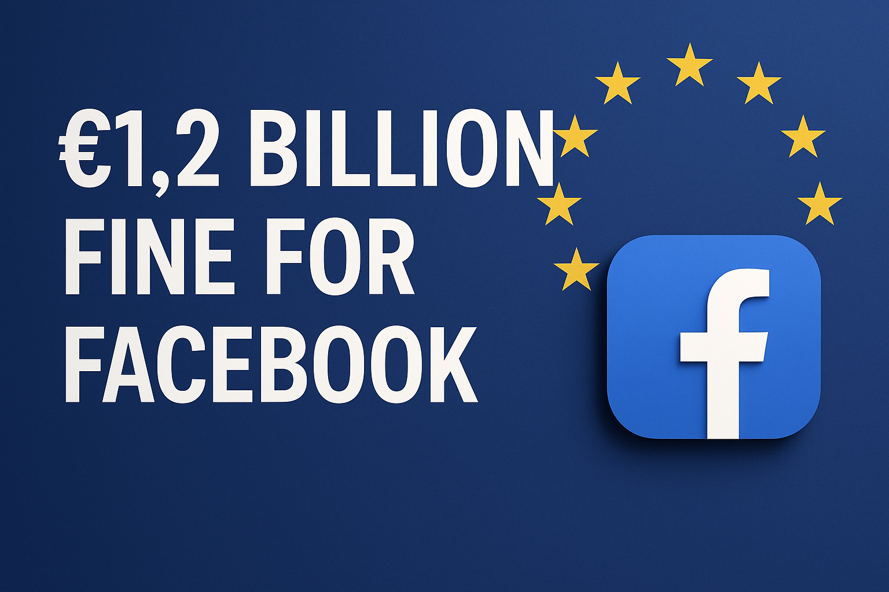

## Security Awareness for Middle Management

---

### Slide 1: What is Information?

::: columns
::: {.column width="60%" .stretch}
Information is anything of value to your organization:

* Intellectual property (e.g., engineering designs)  
* Business contacts (internal or external)  
* Access credentials (keys, access cards, passwords, cryptographic keys)  

**Why it matters**:  
Loss of sensitive information can disrupt operations, cause reputational damage, and lead to legal exposure.  
Unlike physical theft, data breaches often go unnoticed.

**Your role**:  
* Identify sensitive information your team handles  
* Ensure appropriate protection measures  
* Promote awareness among team members  
:::
::: {.column width="40%"}

:::
:::

---

### Slide 2: Information Security Landscape

::: columns
::: {.column width="60%" .stretch}
**Key points**:

* Laws vary by country  
* Compliance is your responsibility  
* Cybersecurity = business risk  

**Your role**:  
* Stay informed on relevant laws and company policies  
* Align team practices with security requirements  
:::
::: {.column width="40%"}

:::
:::

---

### Slide 3: Background Checks

::: columns
::: {.column width="60%" .stretch}
**Why it matters**:  
Vetting reduces internal threats.

**Checks include**:  
* Criminal records  
* Credit history  
* Employment verification  

**Your role**:  
* Ensure vetting is complete  
* Assess access risk by role  
:::
::: {.column width="40%"}

:::
:::

---

### Slide 4: Passwords

::: columns
::: {.column width="60%" .stretch}
**Issues**:  
* Reuse across sites  
* Weak passwords

**Best practices**:  
* Use strong, unique passwords  
* Password managers  
* Enable MFA

**Myth**: Frequent password changes often weaken security.

**Your role**:  
* Lead by example  
* Encourage strong habits  
:::
::: {.column width="40%"}

:::
:::

---

### Slide 5: Email Security

::: columns
::: {.column width="60%" .stretch}
**Threats**:  
* Phishing  
* Malware  
* Social engineering

**Your role**:  
* Promote caution  
* Report suspicious emails  
* Avoid sending sensitive data by email  
:::
::: {.column width="40%"}

:::
:::

---

### Slide 6: Phishing Awareness

::: columns
::: {.column width="60%" .stretch}
**Watch for**:  
* Mismatched sender/address  
* Urgent tone  
* Suspicious links/attachments

**Your role**:  
* Promote “think before you click”  
* Encourage internal reporting  
:::
::: {.column width="40%"}

:::
:::

---

### Slide 7: Network Access

::: columns
::: {.column width="60%" .stretch}
**Wired**:  
No guest access to physical network ports.

**Wireless**:  
* Rotate credentials after staff exit  
* Use enterprise Wi-Fi (RADIUS)

**Your role**:  
* Isolate guest/contractor access  
* Work with IT to enforce controls  
:::
::: {.column width="40%"}

:::
:::

---

### Slide 8: Identify Risks

::: columns
::: {.column width="60%" .stretch}
**What is risk**:  
Anything that causes harm, cost, or loss of reputation.

**Your role**:  
* Learn to spot risks early  
* Promote company-wide awareness  
* Risks are everyone’s problem — not just IT's

**Notes**:  
Consider implementing "Kaizen" (改善):  
"Change for good" — small, continuous improvements.  
:::
::: {.column width="40%"}

:::
:::
