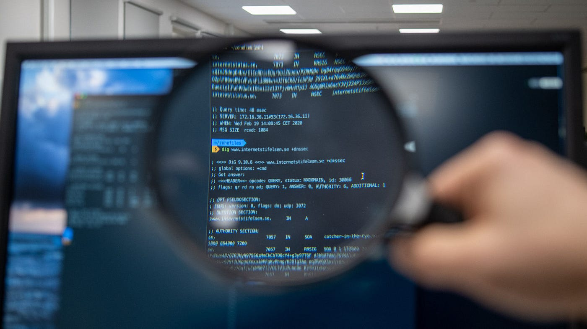
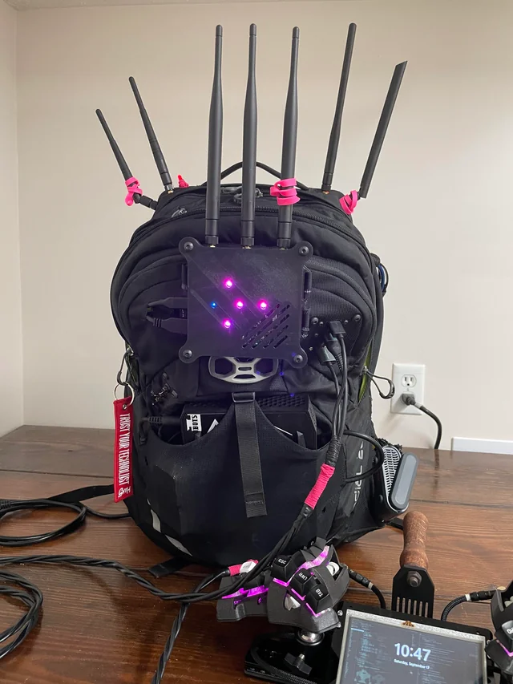

## Security Awareness for Middle Management

# Slide 1: What is Information?

Information is anything of value to your organization:

* Intellectual property (e.g., engineering designs)
* Business contacts (internal or external)
* Access credentials (keys, access cards, passwords, cryptographic keys)

**Why it matters**:
Loss of sensitive information can disrupt operations, cause reputational damage, and lead to legal exposure. Unlike
physical theft, data breaches often go unnoticed which can cause long-term harm.

**What is your role**:

* Identify what information your team handles that is sensitive
* Ensure appropriate protection measures are in place
* Promote awareness among team members

Note:

How do we lose data, by not properly managing it, data that the company owns and holds valuable should not leave company
property, e.g., it is not allowed to create personal backups of company data on personal data carriers; this includes
business contacts.  
Access credentials should be secure, meaning they are not shared or reused.  
Accounts should be linked to a single natural person that has an active contract with the company, furthermore think
about setting up end dates that match with contract end dates.
Access cards: keep in mind that most access cards currently being used are broken, and have been broken for decades,
they are trivial to copy digitally impossible to distinguish from the real one

How do we make sure we don't lose these things,
classify our data
ensure employee contracts have NDA's and that company data is not allowed to leave company property, e.g., laptop,
phones

---

# Slide 2: Information Security Landscape

**What you should know**:

* Different countries have different laws on information security
    * If your company deals with other countries, it is your responsibility to make sure you are compliant with
      regulations
* Regulations like Malaysia's PDPA require proper handling of personal data
* Cybersecurity is no longer just an IT issue — it's a business risk

**Your role**:

* Stay informed on applicable laws and policies
* Align team practices with company-wide security requirements

---

# Slide 3: Background Checks

**Why it's relevant**:
Employees with access to critical systems or data must be vetted to avoid internal threats.

**Typical checks include**:

* Police and criminal background
* Credit history (where relevant)
* Previous employment verification

**Your role**:

* Ensure background checks are completed for your team
* Evaluate roles for access risks

---

# Slide 4: Passwords

**Common issues**:

* Password reuse across platforms
* Weak passwords easily guessed or cracked

**Best practices**:

* Use unique, strong passwords
* Encourage use of password managers
* Enable multifactor authentication (MFA)

** counter security **

* contrary to what some have been told, frequent password changes have been found to have a negative effect on password
  security because it actually pushes people to create insecure passwords

**Your role**:

* Set the expectation for strong password practices
* Lead by example

---

# Slide 5: Email Security

**Threats**:

* Phishing attempts
* Malicious attachments
* Social engineering through email

**Your role**:

* Encourage staff to verify suspicious emails
* Report phishing attempts to IT/security teams
* Avoid forwarding sensitive data through email

---

# Slide 6: Phishing Awareness

**How to spot phishing**:

* Mismatched sender names and email addresses
* Urgent or threatening language
* Unexpected links or attachments

**Your role**:

* Foster a culture of 'think before you click'
* Promote internal reporting of suspicious emails

---

# Slide 7: Network Access

**Wired networks**:

Physical network ports in offices should be secured. Guest access to wired connections should not be allowed, as it
bypasses Wi-Fi security controls.

**Wireless networks**:

Wi-Fi credentials should be updated when an employee leaves the company

For stronger security, use enterprise-grade Wi-Fi with RADIUS authentication, which allows individual user credentials
instead of a shared password

**Your role**:

Ensure that visitor and contractor access is isolated from internal systems

Coordinate with IT to verify network access controls align with security policies

---

# Slide 8: Identify risks

What are risks, risks can be anything that causes harm to the company, its employees or visitors, costs the company
money, causes the money to lose business or reputation.

We deal with risks every day at almost any time, but if we learn to identify these risks we can deal with them before
they happen

Note:

The most important thing to remember is that risks are not a problem for `department-x`, they are a problem for the
company. Therefore, it is advisable to have the entire company be able to identify risks for every department, not just
their own.

---

ToDo: implement Kai-zen `改 kai - change 善 zen - good`, incentivize by giving a monetary reward.
